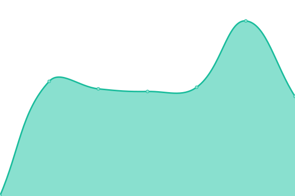
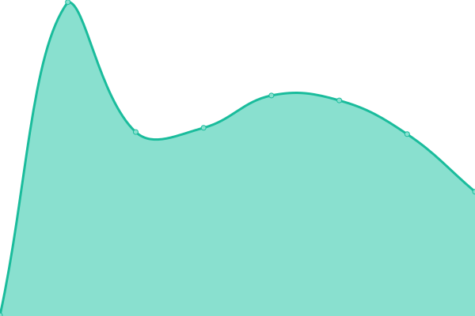

# [📈 Live Status](https://demo.upptime.js.org): <!--live status--> **🟥 Complete outage**

This repository contains the open-source uptime monitor and status page for [Upptime](https://upptime.js.org), powered by [Upptime](https://github.com/upptime/upptime).

With [Upptime](https://upptime.js.org), you can get your own unlimited and free uptime monitor and status page, powered entirely by a GitHub repository. We use [Issues](https://github.com/upptime/upptime/issues) as incident reports, [Actions](https://github.com/mings420/uptime/actions) as uptime monitors, and [Pages](https://demo.upptime.js.org) for the status page.

<!--start: status pages-->
<!-- This summary is generated by Upptime (https://github.com/upptime/upptime) -->
<!-- Do not edit this manually, your changes will be overwritten -->
<!-- prettier-ignore -->
| URL | Status | History | Response Time | Uptime |
| --- | ------ | ------- | ------------- | ------ |
|  [SG AWS1](sgaws1.ip-mings.my.id) | 🟥 Down | [sg-aws-1.yml](https://github.com/mings420/uptime/commits/HEAD/history/sg-aws-1.yml) | 

 1193ms
     
 | 

<a href="https://mings420.github.io/uptime/history/sg-aws-1">0.12%</a>
    

|  [SG VIP1](sgvip1.ip-mings.my.id) | 🟥 Down | [sg-vip-1.yml](https://github.com/mings420/uptime/commits/HEAD/history/sg-vip-1.yml) | 

 684ms
     
 | 

<a href="https://mings420.github.io/uptime/history/sg-vip-1">0.77%</a>
    

|  [SG AWS2](sgawsW.ip-mings.my.id) | 🟥 Down | [sg-aws-2.yml](https://github.com/mings420/uptime/commits/HEAD/history/sg-aws-2.yml) | 

 0ms
     
 | 

<a href="https://mings420.github.io/uptime/history/sg-aws-2">0.00%</a>
    

|  [JP AWS1](jpaws1.ip-mings.my.id) | 🟥 Down | [jp-aws-1.yml](https://github.com/mings420/uptime/commits/HEAD/history/jp-aws-1.yml) | 

 0ms
     
 | 

<a href="https://mings420.github.io/uptime/history/jp-aws-1">0.00%</a>
    

|  [KR AWS1](kraws1.ip-mings.my.id) | 🟥 Down | [kr-aws-1.yml](https://github.com/mings420/uptime/commits/HEAD/history/kr-aws-1.yml) | 

 0ms
     
 | 

<a href="https://mings420.github.io/uptime/history/kr-aws-1">0.00%</a>
    

|  [LOND AWS1](lond1.ip-mings.my.id) | 🟥 Down | [lond-aws-1.yml](https://github.com/mings420/uptime/commits/HEAD/history/lond-aws-1.yml) | 

 0ms
     
 | 

<a href="https://mings420.github.io/uptime/history/lond-aws-1">0.00%</a>
    

<!--end: status pages-->

[**Visit our status website →**](https://demo.upptime.js.org)

## 📄 License

- Powered by: [Upptime](https://github.com/upptime/upptime)
- Code: [MIT](./LICENSE) © [Upptime](https://upptime.js.org)
- Data in the `./history` directory: [Open Database License](https://opendatacommons.org/licenses/odbl/1-0/)
